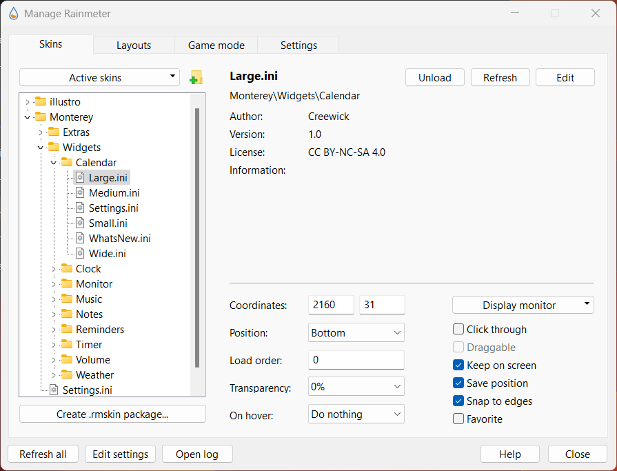
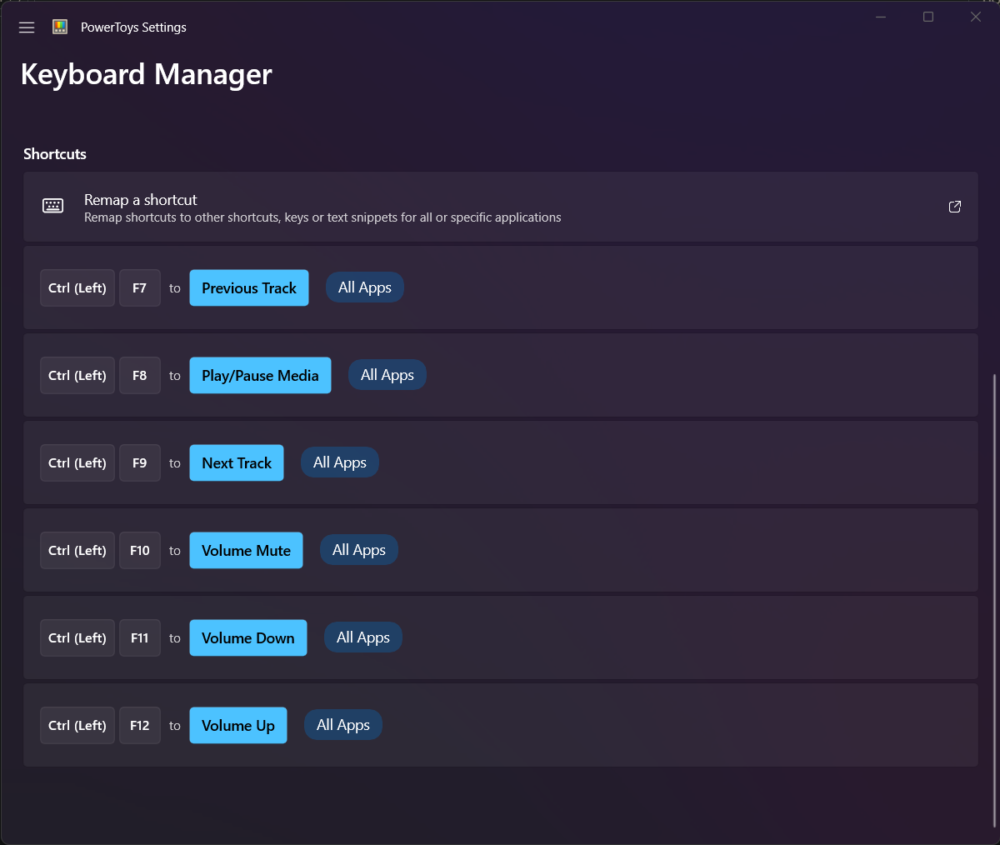
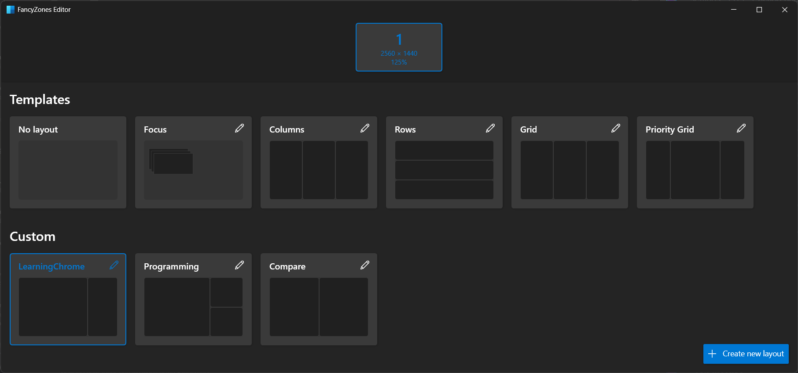
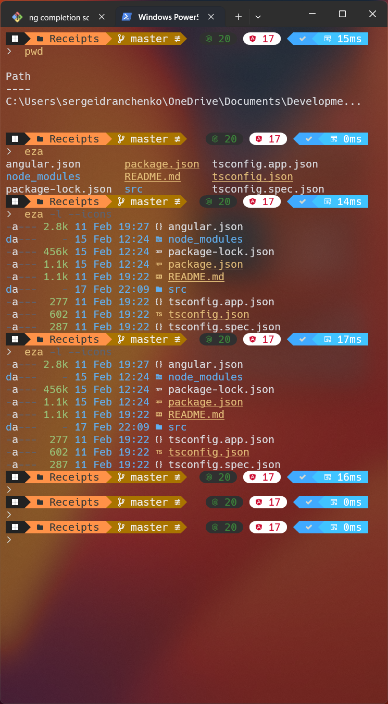

# 🪟 Windows Tips

## ⌨️ Windows 11 hotkeys:

- Change `FansyZones` windows: `cmd` + `shift` + `'`
- Open clipboard history: `cmd` + `v`
- Open menu: `cmd` + `a`
- Change Language: `cmd` + `space`
- Run "Alfred": `alt` + `space`
- Screenshot: `F14`

## 🔍 Hints

To disable change Virtual Desktop animation via `ViVeTool`:

```shell
./vivetool /disable /id:42354458
```

To fix `Rainmeter` DPI scaling (blurry text) [here](https://forum.rainmeter.net/viewtopic.php?t=22272):

Properties -> Compatibility -> Change high DPI settings -> Override high DPI scaling behaviour.

Also to prevent widgets in `Rainmeter` from overflowing windows, change its `Position` in the program to `Bottom`:



Widget positions:

- Calendar (Large) - 2160x31
- Music (Wide) - 2160x400
- Weather (Wide) - 2160x590

## `PowerToys`

Used toys: `Keyboard Manager`, `Fancy zones`, `Quick Accent`, `Awake`

### Keyboard Manager

Remap shortcuts to control volume/lightning with `PowerToys` keyboard settings: `ctrl` + action buttons:



### Fancy zones

Use `cmd` + `shift` + `` ` to open Fancy zones 

Hold `shift` and drag window to a fancy zone:



## `Terminal`

Default terminal: `GitBash`, `PowerShell`

Default application: `Windows Terminal`

### Theme

Chosed theme: One Half Dark

Chosed font: Hack Nerd Font Mono

In `settings.json` for transparent background: 

```json
"profiles": {
    "defaults": {
      "tabTitle": null,
      "useAcrylic": true,
      "opacity": 40
    }
}
```

### Oh my posh

- `oh-my-posh`
- `eza`

Install [`oh-my-posh`](https://ohmyposh.dev/):

```shell
winget install JanDeDobbeleer.OhMyPosh -s winget
```

Install Nerd font - [Hack.zip](https://github.com/ryanoasis/nerd-fonts/releases/tag/v3.1.1)

Install [`eza`](https://eza.rocks/):

```shell
winget install eza-community.eza
```

---

I use custom theme `AtomicMod.omp.json` with `oh-my-posh` in `Bash` and `PowerShell`:



Modified `.bashrc` to use theme in `Bash`:

```sh
# Load oh-my-posh theme
eval "$(oh-my-posh init bash --config "/c/Users/sergeidranchenko/AppData/Local/Programs/oh-my-posh/themes/atomicMod.omp.json")"

# Aliases
alias ll="eza -l --icons"
```

Installed modules for `Powershell`:

```shell
# to enable scripts in powerschell
Set-ExecutionPolicy RemoteSigned
# modules
Install-Module PsReadLine -Force
Install-Module -Name Terminal-Icons -Repository PSGallery -Force
Install-Module -Name z -Force -AllowClobber
```

Modified `$Profile` to use theme in `PowerShell`:

```sh
# Aliases
function list {
	eza -l --icons
}
Set-Alias ll list

# Load oh-my-posh theme
oh-my-posh init pwsh --config "$env:POSH_THEMES_PATH\atomicMod.omp.json" | Invoke-Expression

# Load Terminal-Icons for ls
Import-Module -Name Terminal-Icons

#Functions
function whereis ($command) {
	Get-Command -Name $command -ErrorAction SilentlyContinue |
	Select-Object -ExpandProperty Path -ErrorAction SilentlyContinue
}

# PSReadLine
Import-Module PSReadLine
Set-PSreadLineKeyHandler -Key Tab -Function Complete
Set-PSReadLineOption -PredictionViewStyle ListView
```

Additional Video with some theming [here](https://www.youtube.com/watch?v=5-aK2_WwrmM) and [here](https://www.youtube.com/watch?v=fviSilPKIhs)

## Feed

To remove feed from widgets use [this](https://pureinfotech.com/disable-news-feed-widgets-windows-11)

To remove feed from serach menu use [this](https://answers.microsoft.com/en-us/windows/forum/all/how-to-remove-the-newsfeed-from-the-search-menu-on/401e97d4-23ea-4f3b-b635-865c95eb5f21)

## 🦄 Applications:

- `MiniBin` - bin in taskbar
- `Twinkle Tray` - to change display brightness
- `WinDynamicDesktop` - to use beautiful wallpapers (MacOS Ventura)
- `Rainmeter` - to use widgets (calendar, music - `monterey_rainmeter`)
- `Typora` - for taking notes
- `Audacity` - for editing sounds
- `DeepL` - translator
- `Microsoft ToDo` - simple to do app
- `GitBash` & `GitDesktop` - to use git
- `Zeal` portable - analogue of `Dash` - offline documentation viewer
- `Microsoft Office` - `PowerPoint`, `Word`, `Excel`, `OneNote`
